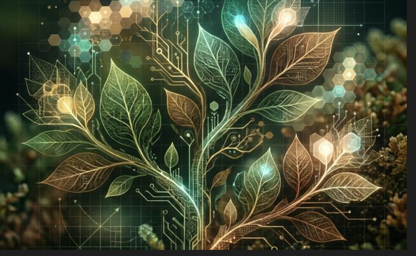

# Naturismo Computacional

"Naturismo Computacional" es un manifiesto vivo sobre la belleza que emerge cuando las leyes matemáticas se encuentran con la aleatoriedad de la naturaleza. Este proyecto es una galería de arte generativo donde cada pieza se crea en tiempo real mediante algoritmos que simulan procesos biológicos.

[**Visita la Galería Online**](https://fervilber.github.io/GenArt/index.html)

## El Concepto

El proyecto busca explorar cómo la computación puede imitar la "imperfección perfecta" del mundo natural. Utilizando sistemas de partículas, campos de fuerza y ruido de Perlin, las obras evolucionan de forma orgánica, creando estructuras que recuerdan a corales, redes neuronales o flujos de agua.

## Detalles Técnicos

- **Tecnología**: Desarrollado íntegramente con **JavaScript** y la biblioteca **p5.js**.
- **Algoritmos**: Implementación de campos de flujo (Flow Fields), fractales recursivos y sistemas de agentes autónomos.
- **Interactividad**: Muchas de las piezas responden al movimiento del ratón o a parámetros configurables en tiempo real, permitiendo al espectador ser parte del proceso creativo.

Puedes explorar la galería completa aquí:
[**Naturismo Computacional - Galería Online**](https://fervilber.github.io/GenArt/index.html)
